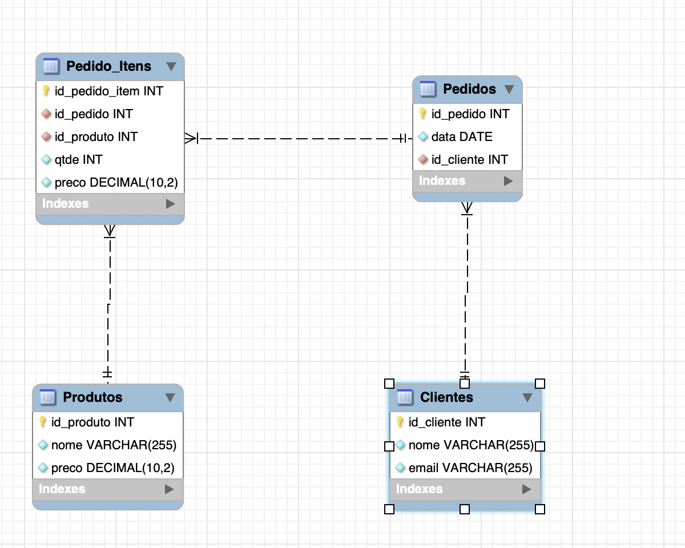

# Inicializando o projeto

Este projeto consiste em uma aplicação completa com backend em Node.js e frontend em Vue.js.

## Passos para inicializar o projeto

1. Abra o terminal e navegue até a pasta do projeto.
2. Navegue até a pasta `backend`

```
cd backend
```

e execute o comando

```
npm i
```

para instalar as dependências do backend.

3. Navegue até a pasta frontend

```
cd frontend
```

e execute o comando

```
npm i
```

para instalar as dependências do frontend, e execute o comando

```
cp .env.example .env
```

para copiar as variaveis necessarias.

4. Navegue até a pasta raiz do projeto e execute o comando

```
docker-compose up -d
```

para subir o container do banco de dados.

5. Navegue até a pasta `backend` e execute o comando

```
npm start
```

para iniciar o servidor do backend.

6. Navegue até a pasta `frontend` e execute o comando

```
npm run dev
```

para iniciar o servidor de desenvolvimento do frontend.

## Acessando a aplicação

A aplicação estará disponível em `http://localhost:5173/`


